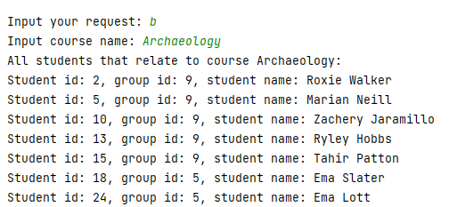

`Task 7 - SQL`

Create an application sql-jdbc-school that inserts/updates/deletes data in the database using JDBC.
Use PostgreSQL DB.

Tables (given types are Java types, use SQL analogs that fit the most:

groups(
	group_id int,
	group_name string
)
students(
	student_id int,
	group_id int,
	first_name string,
	last_name string
)
courses(
	course_id int,
	course_name string,
	course_description string
)
1. Create SQL files with data:

	a. create user and database. Assign all privileges on the database to the user. (DB and user should be created before application runs)

	b. create a file with tables creation

2. Create a java application

	a. On startup, it should run SQL script with tables creation from previously created files. If tables already exist - drop them.

	b. Generate test data:

		* 10 groups with randomly generated names. The name should contain 2 characters, hyphen, 2 numbers

		* Create 10 courses (math, biology, etc)

		* 200 students. Take 20 first names and 20 last names and randomly combine them to generate students.

		* Randomly assign students to groups. Each group could contain from 10 to 30 students. It is possible that some groups will be without students or students without groups

		* Create relation MANY-TO-MANY between tables STUDENTS and COURSES. Randomly assign from 1 to 3 courses for each student

3. Write SQL Queries, it should be available from the application menu:

	a. Find all groups with less or equals student count

	b. Find all students related to course with given name

	c. Add new student

	d. Delete student by STUDENT_ID

	e. Add a student to the course (from a list)

	f. Remove the student from one of his or her courses


Useful links:

Be aware that videos were made for the Java 6 course. Now we are using Java 8+.

https://youtu.be/bYyKQmYyGZg
 
https://youtu.be/flMFICpPfcI

`Instuction how run applicatian sql-jdbc-school:`

* Befor run applicatian in docker you must install docker  as in this instruction https://docs.docker.com/desktop/


```
Then can run start_bat or start_sh.
For stop work close console end run stop_bat or stop_sh scripts.
```

```
If app runs but you get errors, cell developers.
```

* You version.


`Integratin tests`


`Sceeshots work:`

`a`


`b`



`c`


`e`


`f`


`g`


`i`


`k`


`l`


`m`


`n`


`o`


`p`


`q`


`r`


`s`


`t`

